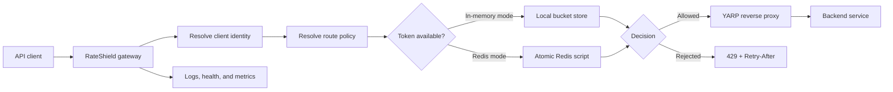

# RateShield

[](https://github.com/nosaemma21/RateShield/actions/workflows/ci.yml)


RateShield is an ASP.NET Core API gateway that applies configurable token-bucket
rate limits before forwarding traffic through YARP. It supports fast in-memory
limiting for one gateway and atomic Redis-backed limiting across multiple
gateway instances.

**Live staging gateway:**
[rateshield-gateway-staging.onrender.com](https://rateshield-gateway-staging.onrender.com/health/ready)

> The demo uses Render's free tier, so the first request after inactivity can
> take longer while the service wakes up. Staging is the selected hosted scope;
> a paid production environment is intentionally not provisioned.

## Why This Project Exists

APIs need a protection layer that behaves consistently as traffic and instance
count grow. RateShield keeps that concern at the gateway boundary: it identifies
the client, resolves the route policy, makes one token-bucket decision, returns
standard response metadata, and only then forwards an allowed request.

The repository is a production-foundation project rather than a hosted SaaS
product. It demonstrates distributed state, failure behavior, configuration
validation, observability, load testing, container delivery, and staged CI/CD.

## Highlights

- Route-specific token-bucket policies with capacity, refill, and request-cost
  controls.
- Client identity from API key, client ID, authenticated claim, or remote IP.
- Atomic Redis evaluation for shared limits across horizontally scaled gateways.
- Configurable `FailClosed` or `FailOpen` behavior when Redis evaluation fails.
- HTTP `429` responses with `Retry-After` and `X-RateLimit-*` headers.
- Idle in-memory bucket cleanup with bounded scans and graceful shutdown.
- Liveness, dependency-aware readiness, Prometheus metrics, correlation IDs,
  structured logs, and sensitive-header redaction.
- Docker Compose environment with the gateway, Redis, and a sample backend.
- Automated unit, integration, Redis container, and k6 load tests.
- GitHub Actions for formatting, vulnerability auditing, tests, coverage,
  container scanning, GHCR publishing, Render validation, and staging deployment.

## Request Flow



Only YARP-matched proxy routes consume quota. Gateway-owned endpoints such as
`/health/live`, `/health/ready`, and `/metrics` bypass the limiter.

## Try The Hosted Gateway

From PowerShell:

```powershell
$baseUrl = "https://rateshield-gateway-staging.onrender.com"

(Invoke-WebRequest -UseBasicParsing "$baseUrl/health/ready").StatusCode
curl.exe -i -H "X-Client-Id: portfolio-demo" "$baseUrl/api/hello"
```

The proxied response comes from the separately deployed sample backend. Repeat
the second request to watch `X-RateLimit-Remaining` change; a burst beyond the
configured capacity returns `429 Too Many Requests` with `Retry-After`.

## Run Locally With Docker

Prerequisites: Docker Desktop with Compose.

```powershell
git clone https://github.com/nosaemma21/RateShield.git
cd RateShield
docker compose up --detach --build

(Invoke-WebRequest -UseBasicParsing http://localhost:8080/health/ready).StatusCode
curl.exe -i -H "X-Client-Id: local-demo" http://localhost:8080/api/hello
```

Compose starts:

| Service | Address | Purpose |
| --- | --- | --- |
| Gateway | `http://localhost:8080` | Rate limiting, health, metrics, and proxying |
| Sample backend | `http://localhost:8081` | Upstream API used to verify forwarding |
| Redis | `localhost:6379` | Shared token-bucket state |

Stop the environment with:

```powershell
docker compose down
```

For separate `dotnet run` terminals and endpoint examples, see the
[local run guide](docs/local-run.md).

## Configuration Example

RateShield uses normal ASP.NET Core configuration layering. Nested environment
variables use double underscores:

```text
RateShield__Storage__Mode=Redis
RateShield__Storage__FailureBehavior=FailClosed
RateShield__Redis__ConnectionString=<secret Redis URI>
RateShield__Policies__Default__Capacity=100
RateShield__Policies__Default__RefillTokens=10
RateShield__Policies__Default__RefillPeriodSeconds=1
RateShield__Routes__sample-api__PolicyName=Default
```

Secrets stay outside source control. See the
[configuration reference](docs/configuration.md) for every setting and the
[secrets guide](docs/secrets.md) for safe handling.

## Tests And Quality Gates

Run the .NET test suite:

```powershell
dotnet test RateShield.sln
```

The current suite contains 84 passing tests across core behavior, middleware,
configuration validation, proxy integration, Redis URI parsing, and an atomic
Redis integration test backed by a temporary container.

Run a basic k6 workload after starting Compose:

```powershell
k6 run tests/load/rateshield-smoke.js
k6 run tests/load/rateshield-burst.js
```

The repository also includes sustained, high-cardinality, mixed-policy,
latency, memory, cleanup, and multi-instance Redis workloads. Reproduction
details are in the [testing guide](docs/testing.md).

### Recorded Local Results

| Scenario | Result |
| --- | --- |
| Burst | 200 requests: 100 allowed and 100 valid `429` responses |
| Sustained | 10 requests/s for 30 seconds with no failures or dropped iterations |
| Mixed policies | Default capacity 100 and Strict capacity 20 enforced independently |
| Cleanup under load | 11,500 requests passed while 10,051 stale buckets were removed |
| Two Redis-backed gateways | One shared capacity: exactly 100 allowed and 100 limited |

These are development measurements, not production capacity promises. Full
numbers, environment details, and limitations are documented in
[load and performance results](docs/performance.md).

## Repository Structure

```text
src/RateShield.Core            domain models and rate-limiting contracts
src/RateShield.Infrastructure  in-memory/Redis stores, cleanup, and metrics
src/RateShield.Gateway         ASP.NET Core host, middleware, health, and YARP
src/RateShield.SampleBackend   upstream service used for end-to-end validation
tests/                         unit, integration, Redis, and k6 tests
docs/                          operations, security, architecture, and deployment
```

## CI/CD And Deployment

Pull requests run formatting, dependency auditing, Release builds, tests with
coverage, Render Blueprint validation, and vulnerability scans for both Docker
images. Successful main-branch runs publish gateway and sample-backend images
to GHCR, trigger the Render staging deploy hook, and smoke-test liveness and
readiness.

The live staging deployment uses:

- a public RateShield gateway;
- a separately hosted sample backend;
- a dedicated Render Key Value instance for shared Redis state; and
- fail-closed readiness when Redis is unavailable.

The production path is designed and documented but deliberately unprovisioned
because this portfolio deployment uses free-tier resources. See the
[Render deployment guide](docs/render-deployment.md).

## Documentation

- [Gateway flow](docs/gateway-flow.md) — request ordering, YARP routing, policy
  resolution, headers, and failure responses.
- [Redis implementation](docs/redis.md) and
  [distributed design](docs/redis-design.md) — atomic decisions, keys, expiry,
  failure modes, and scaling.
- [Observability](docs/observability.md) — logs, metrics, health checks, and
  correlation IDs.
- [Security guidance](docs/security-guidance.md) and
  [trusted proxies](docs/trusted-proxies.md) — identity boundaries, redaction,
  forwarded headers, and deployment hardening.
- [Testing](docs/testing.md) and [performance](docs/performance.md) — automated
  suites, k6 workloads, results, and reproducibility.
- [Known limitations](docs/known-limitations.md) — explicit product boundaries
  and work still required before a real production rollout.

## Current Scope

RateShield is a serious gateway foundation, but it does not claim to replace a
full API-management platform. Current boundaries include process-local metrics,
configuration-driven policies, and no administrative control plane. Review the
[known limitations](docs/known-limitations.md) before adapting it to production.
